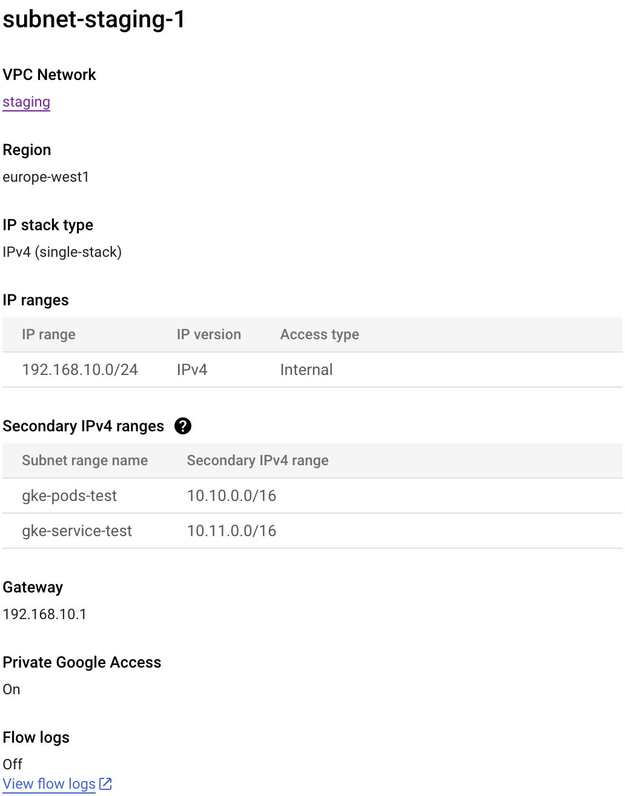

# Prerequisites

<!-- START doctoc generated TOC please keep comment here to allow auto update -->
<!-- DON'T EDIT THIS SECTION, INSTEAD RE-RUN doctoc TO UPDATE -->
**Table of Contents**  *generated with [DocToc](https://github.com/thlorenz/doctoc)*

- [Prerequisites](#prerequisites)

<!-- END doctoc generated TOC please keep comment here to allow auto update -->

A VPC network needs to be setup, with a subnet that has two secondary IP ranges.

In the example, they are named `gke-pods-test` and `gke-service-test` but of course feel free to rename these.

Here is an example screenshot in the GCP console:

